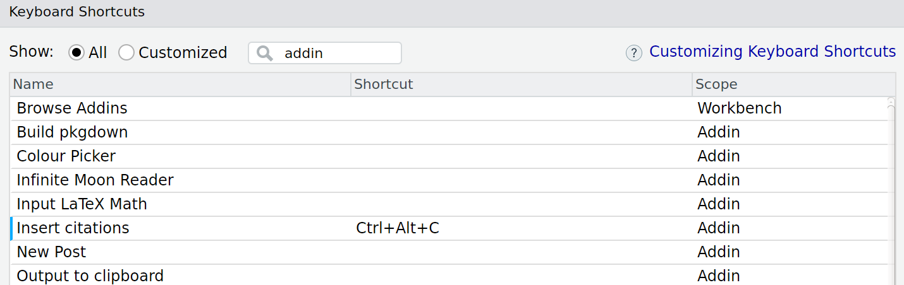
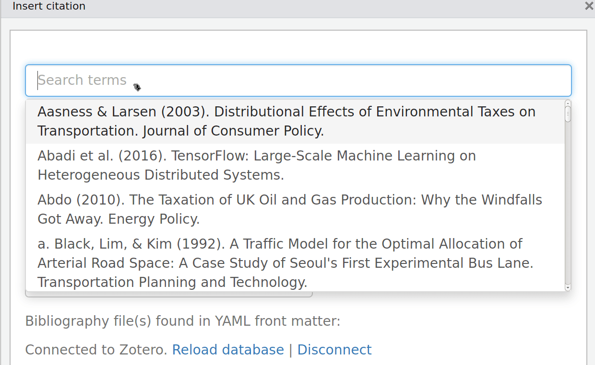

<!-- README.md is generated from README.Rmd. Please edit that file -->
rmarkdown-citr-demo
===================

The goal of rmarkdown-citr-demo is to demonstrate how to add citations from a bib file.

First install **citr**:

``` r
install.packages("citr")
```

Then maybe set-up an addin shortcut (e.g. `Ctl+Alt+C`):



Then create a .bib file with a reference manager such a [Zotero](https://www.zotero.org/).

Magically when you run `citr::insert_citation()`, either directly or by entering your shortkey of choice, you'll get an interactive interface to your citations:



The GUI-action results in the following text string being inserted into your document wherever the cursor was last located, like this: `[@hopkins_transition_2008]`.

This, when not in monotype, results in a citation when compiled by **knitr**, like this (Hopkins, 2008).

The reference list is then automagically created (see below). As explained on the [Bibliographies and Citations](http://rmarkdown.rstudio.com/authoring_bibliographies_and_citations.html) page on the RStudio website, you can modify the citation style. I've chose the University of Leeds' version of the Harvard citation style ([harvard-university-of-leeds.csl](https://github.com/citation-style-language/styles/blob/master/harvard-university-of-leeds.csl)).

References
==========

Hopkins, R. 2008. *The transition handbook* \[Online\]. London: Green Books. Available from: [http://www.familyforests.org/congress/Transition Handbook.pdf http://www.familyforests.org/congress/Transition Handbook.pdf](http://www.familyforests.org/congress/Transition Handbook.pdf http://www.familyforests.org/congress/Transition Handbook.pdf).
